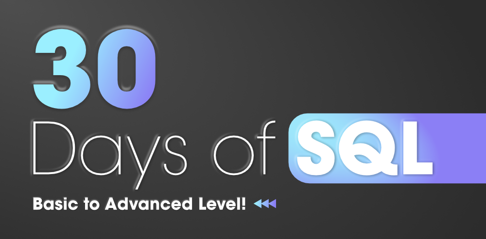

###### **Structured Query Language** or **SQL **is a standard database language that is used to create, maintain, destroy, update and retrieve the data from relational databases like MySQL, Oracle, SQL Server, PostgreSQL, etc.

